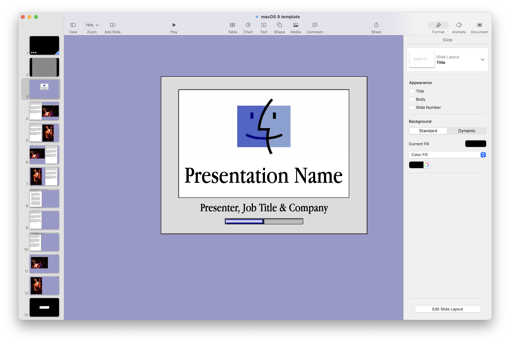

# Mac OS 9 Keynote Template

You will need to install the Apple Garamond font, which can be found in this repo.

This is a keynote template designed to look like Classic Mac OS

You have options for picture only, text only, or text and picture.

To change the picture, right-click on it and choose replace image

To change the text, double-click on the test and type away.

# Credits

Screenshots generated from [infinitemac](https://infinitemac.org)

Lorem ipsum text uses lyrics from [Sloan](https://sloanmusic.com) songs written by Jay Ferguson, Chris Murphy, Patrick Pentland and/or Andrew Scott

Lorem ipsum text generated using a Sloan generator made by Ruhee Dewji and on her [github](https://www.github.com/ruhee). Hi Ruhee!
